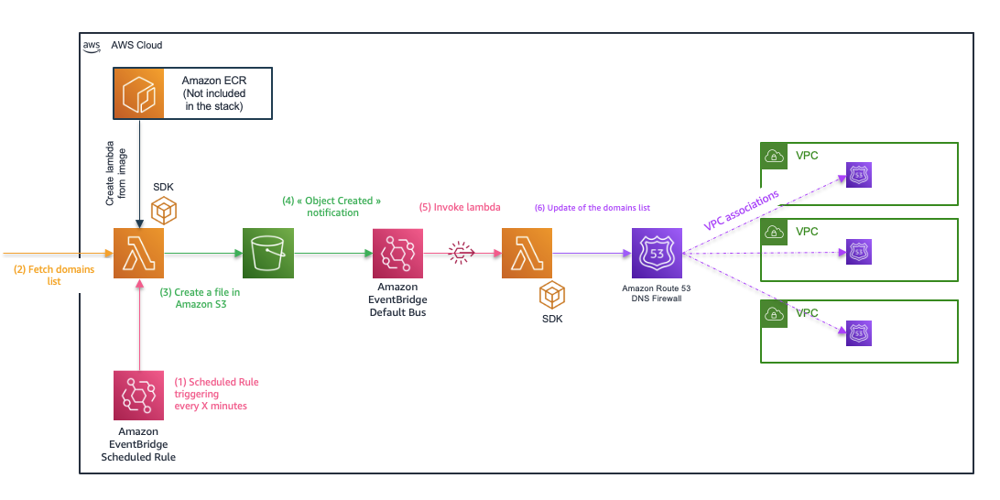

## DNS Firewall Automation : Bring your own Lambda

Inspired from : https://github.com/aws-samples/amazon-route-53-resolver-firewall-automation-examples-2 and https://github.com/aws-samples/amazon-route-53-resolver-dns-firewall-automation-examples, this code repository leverage the possibility of being able to deploy lambda as container to offer the possibility to "Bring your own lambda" to fetch the DNS firewall list according to the source and the protocol of your choice for more flexibility.

**Architecture principles**



**Solutions specifications**

*Lambda*
1. It must be containerized and stored in an ECR repository
2. It must upload a file to the S3 bucket created, the format of which must be compliant with the use of the API "ImportFirewallDomains". (See : https://docs.aws.amazon.com/Route53/latest/APIReference/API_route53resolver_ImportFirewallDomains.html)
3. It can reference the name of the bucket from the environnement variables
4. It can reference the name of the region from the environnement variables
5. If the lambda need to make more call to AWS Services : permissions associated to the used role must be extended

*S3*
1. Only files related to the use of this solution should be uploaded to the bucket. The bucket has a bucket policy to enforce this statement

*Route53resolver*
1. For the fetched domain list to be effective and to filter DNS requests, it must be associated with a rule groups that is then associated with VPC(s)

**Before deploying :**
- Create an Elastic Container Registry (ECR)
- Containerize the code and push the image to the registry

**With this template, you will deploy the following resources :**
- 1 Scheduled rule,that will invoke first lambda every X minutes
- 1 Rule,that will trigger the LambdaAutoUpdateDnsFW Lambda function
- 1 S3 bucket, that will be used in order to store the retrieved domain lists
- 1 S3 bucket policy, to enforce that the S3 bucket is only acessed by lambda's principals
- 2 Lambdas, One from the ECR registry to fetch the domain lists and one that will perform the ImportFirewallDomains call
- 2 Lambda log groups that will contain the logs from the deployed lambdas
- 2 Lambda permission to authorize eventbridge to call the deployed lambda
- 2 IAM Role associated with the 2 lambdas
- 2 IAM Policy associated with the lambda's role
- 1 route53resolver domain list that will be kept up to date by the automation process

**To deploy :** 

With the aws-cli : ``` aws --region <region> cloudformation create-stack --stack-name AutoFetchDomainStack --capabilities CAPABILITY_NAMED_IAM --template-body file://./AutoFetchDomainContainerStack.cfn.yaml --parameters ParameterKey=ParamS3DomainListBucketName,ParameterValue=<Bucket-name> ParameterKey=ParamFirewallDomainListName,ParameterValue=<Domain-list-name> ParameterKey=ParamScheduleRate,ParameterValue=<Rate in minutes> ParameterKey=ParamLambdaImageURI,ParameterValue=<image uri including tag>```

**To delete :**
With the aws-cli : ```aws s3 rm s3://<ParamS3DomainListBucketName> --recursive && aws --region <region> cloudformation delete-stack --stack-name AutoFetchDomainStack```

**Note :**
- The retention policy on the "ParamS3DomainListBucketName" that will be created is set to 24h
- The log groups of the deployed lambdas are set to retain log for a duration of 1 month

## Security

See [CONTRIBUTING](CONTRIBUTING.md#security-issue-notifications) for more information.

## License

This library is licensed under the MIT-0 License. See the LICENSE file.